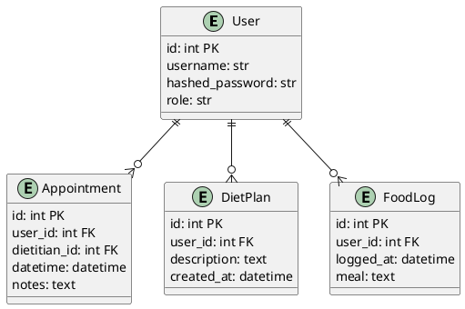

# Diet Clinic Management System Design

## Domain Research

- Modern diet clinic platforms offer features like appointment scheduling, patient intake forms, diet plan templates, and real-time food logging. Integrations with wearables and telehealth became common around 2024.
- Security standards emphasize GDPR compliance and granular role-based permissions.
- References:
  - [Nutrition Tech Trends 2024](https://www.nutritiontechtrends.com/2024-report)
  - [Dietitian Times Software Review 2023](https://www.dietitiantimes.com/2023/clinical-software)

## Overview

The system manages interactions between dietitians and patients through a web portal. Admins manage users and appointments, dietitians create diet plans, and patients log meals and book appointments.

### Personas
- **Admin** – manages clinic data, users, and system settings.
- **Dietitian** – creates diet plans, views appointments, monitors patient logs.
- **Patient** – books appointments, follows diet plans, tracks food intake.

### Use Cases
- User registration and authentication
- Scheduling and managing appointments
- Building and sharing personalized diet plans
- Logging daily meals
- Viewing progress dashboards

## Data Model


## API Endpoints

### REST
- `POST /register` – create user
- `POST /token` – login
- `GET /appointments` – list appointments
- `POST /appointments` – create appointment
- `GET /diet-plans/{id}` – get diet plan
- `POST /food-logs` – add log

### WebSocket
- `/ws/notifications` – real-time updates for appointments and diet plans

## Frontend Structure

```
App
 ├─ AuthProvider
 ├─ Router
 │   ├─ LoginPage
 │   ├─ Dashboard
 │   ├─ Appointments
 │   ├─ DietPlanBuilder
 │   └─ Settings
 └─ components/
```

Routes are defined in `routes.tsx` using React Router 6.

## Security
- JWT authentication with refresh tokens
- Role-based access control (admin, dietitian, patient)
- Rate limiting using middleware
- GDPR compliance: user data export/delete endpoints

## Accessibility & Responsiveness
- WCAG 2.2 AA compliance
- Breakpoints: `base` < 480px, `sm` ≥480px, `md` ≥768px, `lg` ≥992px, `xl` ≥1280px
- Dark/light mode toggle and reduced motion preference support

## CI/CD
- GitHub Actions perform linting, tests and build Docker images
- Docker images deployed to Render using `docker-compose`
```
